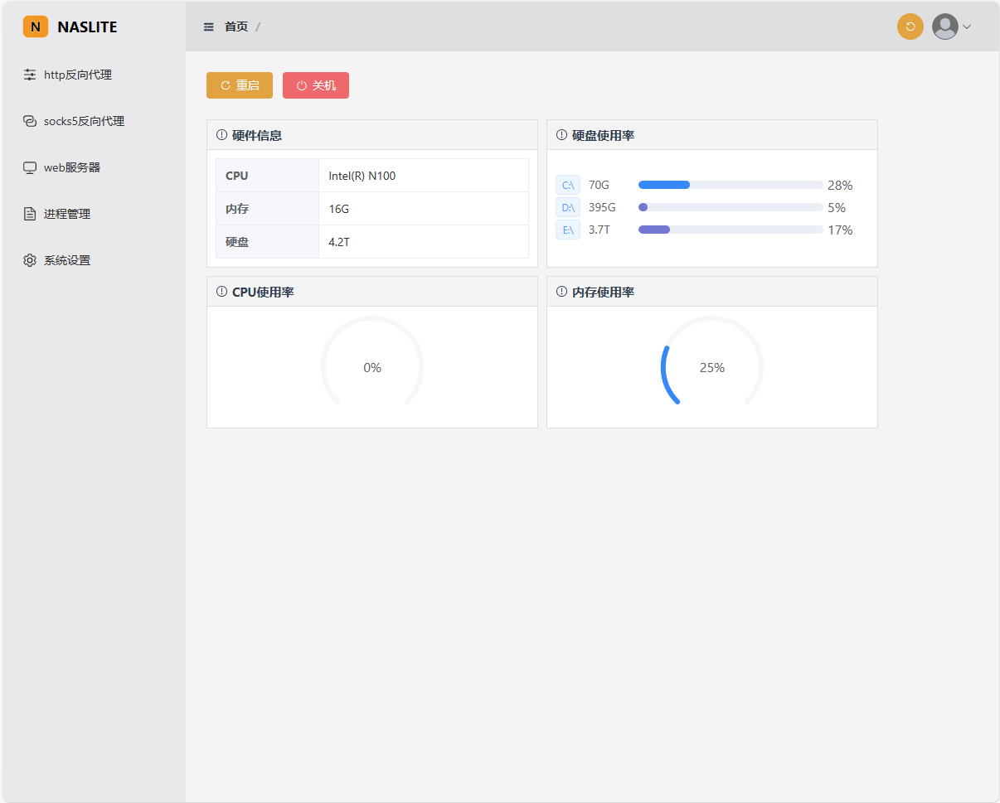
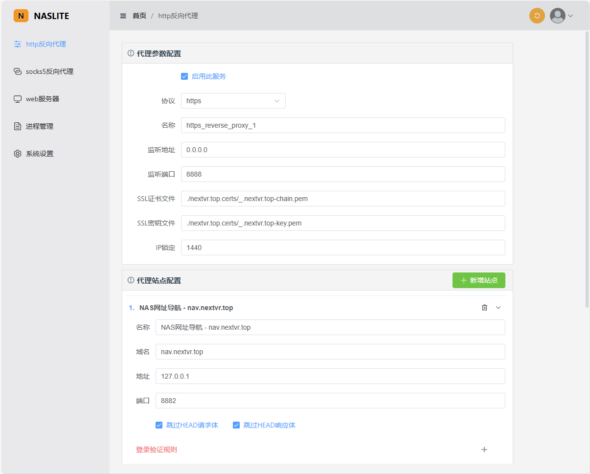
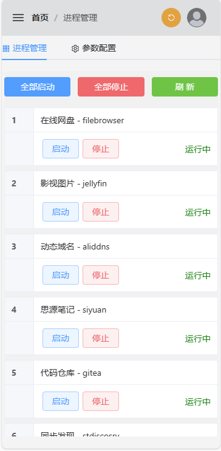
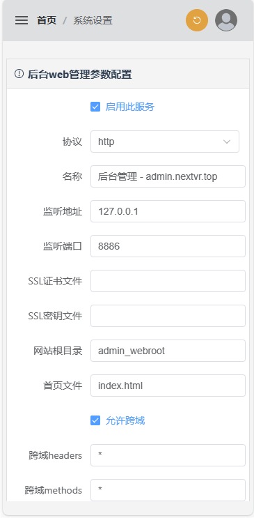

# naslite
# 介绍
- 这是一个开源的轻量级nas管理软件，包括http反向代理，socks5反向代理，静态web服务器，nas应用进程管理；
- 此项目来源于我个人的需求，Windows Server 2022系统，家里有公网IP，主要做家庭相册和看电影用，后端应用有FileBrowser,Jyellyfin,Gitea,SiYuan,Syncthing等（后端所有应用均为开源项目，非开源项目的应用基本上不考虑），但我担心这些后端应用会不会哪里有尚未暴露的漏洞，所以想统一NAS入口，让整个NAS只有一两个端口开放，因此做了http/https反向代理，所有后端应用全部本地化，只能通过反向代理才能访问，代理支持对后端应用的登录进行拦截，登录失败次数过多就锁定IP禁止访问，一定程度上避免对账号密码的暴力尝试，这对那些没有验证码也没有对登录失败进行安全处理的后端应用，有一定的保护作用；socks5反向代理，是用于一些其它服务的访问(如远程桌面)，配合SocksCap这个软件，就可以实现NAS上的所有应用都必须通过反向代理才能访问；根据入口的日志监控，出了问题也能大致锁定原因在哪里。

# 特性
- 完全开源
- 后端：C++23 boost asio coroutine
- 前端：vue3 + Element Plus
- 目前仅做了Windows系统下的编译和使用

# 功能模块
- http/https反向代理
- socks5反向代理
- 静态http/https web服务器
- nas应用进程管理
- 支持通过web进行远程管理

# 编译
## Windows
- 安装CMake, Visual Studio 2022, Node.js
### 编译后端
- 打开项目根目录（包含3rd,doc,frontend,CMakeLists.txt这些文件的目录就是根目录）
- 打开cmd
- 执行以下命令：
- cmake . -DCMAKE_BUILD_TYPE=Release -B build
- 完成后会在build目录中生成Visual Studio 2022的.sln工程文件，使用Visual Studio 2022打开它进行编译即可
- 需要编译的项目有(直接F7生成解决方案即全部编译也可以)：naslite, prepose, windows-kill-library
- 或者直接使用以下命令进行编译
- cmake --build build --config Release
- 完成后会在build/Release目录中生成exe可执行程序等项目文件
### 编译前端
- 打开项目根目录中的frontend子目录
- 打开cmd
- 执行以下命令：
- npm install
- npm run build
- 完成后在frontend/dist目录中生成的文件即是前端网页文件
## Linux
- 安装CMake, GCC, Node.js
- 待补充...

# 使用
## Windows
- 完整的NasLite应用，会包含以下几个文件：
  - naslite.exe 核心程序
  - naslite.json 配置文件（将/naslite/naslite.json复制过来即可）
  - prepose.exe 停止进程时会用到的辅助程序
  - windows-kill-library.dll 停止进程的核心动态库
- 将/naslite/naslite.json配置文件复制到naslite.exe所在的目录中
- 将前面编译前端时所生成的dist文件夹复杂到naslite.exe所在的目录中
- 运行naslite.exe
- 在浏览器中输入http://127.0.0.1:8888打开后台管理页面，默认账号admin 默认密码123456 登录之后进行完整的配置即可（这里使用了127.0.0.1来进入后台管理只是初步演示所用，想要完整的使用NasLite所有功能，必须要有域名才可以）
## Linux
- 待补充...

# 演示站点
- 自用NAS：[https://nav.nextvr.top:8888/](https://nav.nextvr.top:8888/)

# 所用服务
- 域名-阿里云DDNS SDK： [https://api.aliyun.com/api/Alidns/2015-01-09/UpdateDomainRecord?tab=DEMO&lang=CSHARP](https://api.aliyun.com/api/Alidns/2015-01-09/UpdateDomainRecord?tab=DEMO&lang=CSHARP)
- SSL证书(泛域名)：win-acme

# web远程管理(自适应电脑屏幕和手机端)

